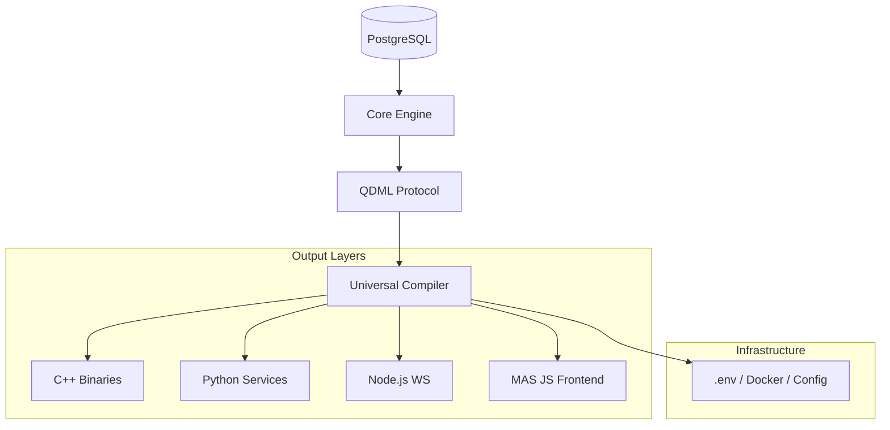

# AI-First Unified Platform — The Schema-Native Ecosystem


## 🌐 The Vision: Coding as Data

Welcome to the future of software development. **AI-First** is not just another framework; it is a **paradigm shift**. In this ecosystem, we treat the entire software lifecycle—logic, schema, UI, infrastructure, and configuration—as **structured data** stored natively in PostgreSQL.

We have eliminated the "messy files" problem. No more drifting configurations, no more chaotic directory structures. The database is the **Single Source of Truth**.

### 🚀 Key Philosophies
1. **Zero-File Development**: Humans and AIs interact with the system via the **QDML Protocol**.
2. **Atomic Components**: Every piece of software is an atomic unit composed of four pillars: **Schema, Logic, Template, and Style**.
3. **Database-Native Infrastructure**: Environment variables, Dockerfiles, and package manifests are stored as database artifacts.
4. **Universal Compiler**: A high-performance engine that compiles database states into executable bundles for C++, Python, Node.js, and the MAS JS framework.

---

## 🛠 The Core Architecture

The system is built on a high-performance **Kernel** that manages the transition from Data to Execution.

### 1. The QDML Protocol (Quantum Data Mutation Language)
A rigorous, atomic protocol for interacting with the software tree:
- **`describe`**: Reveal the structure of modules and components.
- **`mutate`**: Atomic updates to component pillars with event-sourced audit logs.
- **`reveal`**: Fetch the complete state of a component.
- **`compile`**: Transform the database state into physical artifacts using optimized strategies.

### 2. Multi-Language Orchestration
One system to rule them all:
- **C++ ORM Core**: High-performance, schema-driven database interaction.
- **Python FastAPI Gateway**: Secure, scalable API management.
- **Node.js WS Relay**: Real-time delta synchronization and pub/sub.
- **MAS JS Framework**: A state-of-the-art VDOM engine for reactive, high-performance frontends.

### 3. Compilation Strategies
- **Single-Bundle**: High-density monolithic execution files.
- **Component-Split**: Atomic file generation for traditional CI/CD integration.
- **Target-Specific**: Optimized builds for specific deployment environments.

---

## 🏗 System Tree Structure



---

## ⚡ Quick Start

### Prerequisites
- Python 3.10+
- PostgreSQL 16+
- Docker Desktop

### 1. Initialize the Kernel
```bash
# Set up the environment
pip install -r requirements.txt

# Boot the schema and system tree
python core/bootstrap.py
```

### 2. Compile the Ecosystem
```bash
# Generate the executable bundles
python core/fill_cpp.py
```

---

## 📜 The Manifest
This project is dedicated to the **Advanced Agentic Coding** era. It is built to be the perfect environment for AI agents to build, maintain, and scale complex full-stack applications with mathematical precision and zero overhead.

**AI-First: Because files were meant for humans, but data belongs to the future.**

---
*Created with ❤️ by the AI-First Foundation.*
